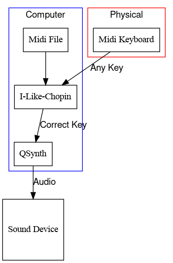

# I like Chopin
Funny program for play like Chopin.
(tribute to Gazebo)

    

Is a very special midi player, use Python3, Mido midi library and Qt6.
Any random key pressed on physical keyboard play the correct note from midi file. Then all keys are released, midi player stop.
You need physical Midi keyboard connected to computer (USB), audio server Jack with QJackCtl, a virtual synthetizer as QSynth with a SoundFont, a Midi file.

Impress your friends with this musical magic trick !

    

