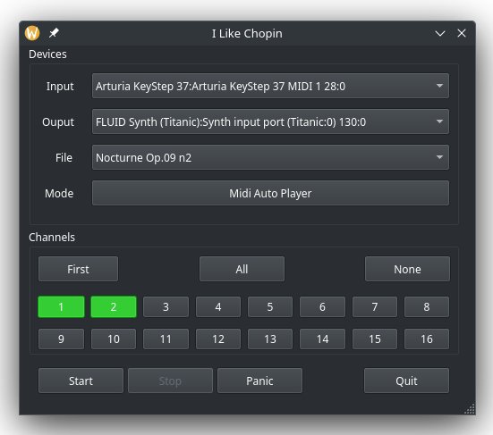

# I like Chopin
Funny program for play like Chopin.
(tribute to Gazebo)

    

It is a very special MIDI player that uses Python 3, the Mido MIDI library, and Qt6. Any random key pressed on a (physical) midi piano or keyboard plays the correct note from the MIDI file. When all keys are released, the MIDI player stops. You need a physical MIDI keyboard connected to the computer via USB, an audio server like Jack with QJackCtl, a virtual synthesizer such as QSynth with a SoundFont, and a MIDI file.

Impress your friends with this musical magic trick!

    

