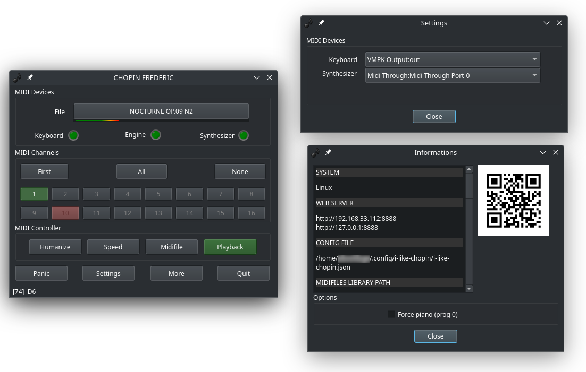

# I like Chopin
Funny program for play like Chopin.
(tribute to Gazebo)

"*In memory of all the electric pianos bought for children who no longer use them.*"

<p align="center">
    
</p>

# Description

"I like Chopin" is a very special MIDI player for Linux, Mac and Windows that uses Python3 with three operating modes: simple MIDI **player**, **passthrough**, and **playback**. The last allows you to play like Chopin.It is a awesome mode that ensures any key you press on the keyboard will always play the correct note from a selected MIDI file. You need a physical MIDI keyboard or piano connected to the computer, the selection of music is done by an internal web server, at the URL http://127.0.0.1:8888.

Bring your piano back to life and impress your friends with this musical magic trick!

# Recommanded usage
## Install poetry and libraries

```bash
curl -sSL https://install.python-poetry.org | python3 -
cd src
poetry install
```

## Run

```bash
poetry run python i-like-chopin.py
```

# Connections

With a Virtual Synth       |With Piano in Daw Mode     | With Rack Synth
:-------------------------:|:-------------------------:|:-------------------------:
 |  | 

# Programs and libraries used

* Python 3.10.12
* mido 1.2.10 ( and pip install packaging importlib_metadata)
* python-rtmidi 1.4.7
* PySide6 6.7.1
* netifaces 2 0.0.22
* qrcode 7.4.2
* pillow =10.4.0

# Utilities

No native virtual MIDI driver is provided with Windows, but there are a number of them available for free:

* [RTP loopMIDI](https://www.tobias-erichsen.de/) developed by Tobias Erichsen, who also programmed a version of the Network MIDI driver for Windows.
* [MIDI Yoke](https://www.midiox.com/) which is part of the MIDI OX utility (32 bits only).

# Tested with...
* Raspberry Pi 4 Model B / Debian 12 (bookworm)
* Ubuntu 24.04 LTS ALSA/JACK
* Windows 10 / RTP loopMIDI / OmniMIDI / VirtualMIDISynth
* MacOS 14.6.1
* USB to Midi CME U2MIDI Pro
* Steinberg UR22mkII
* Modartt Pianoteq Stage
* Keyboard Arturia Keystep 37
* Piano Yamaha Clavinova CLP-123 -> LOCAL OFF = press MIDI/TRANSPOSE then PIANO1 (must lite)


# Thanks

Thank you to [cyri11e](https://github.com/cyri11e) for carrying out the program tests on MacOS and for his great patience.
