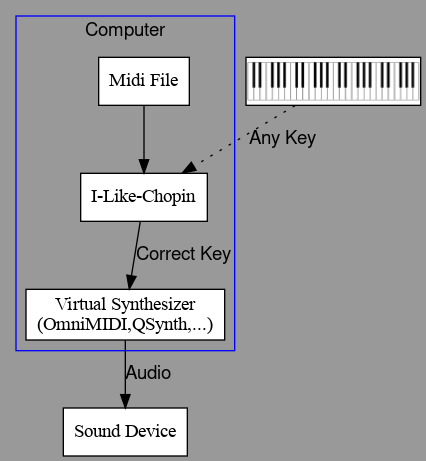

# I like Chopin
Funny program for play like Chopin.
(tribute to Gazebo)

"*In memory of all the electric pianos bought for children who no longer use them.*"

<p align="center">
    
</p>

# Description

"I like Chopin" is a very special MIDI player for Linux, Mac and Windows that uses Python3. With three operating modes: simple MIDI **player**, **passthrough**, and the last **playback** allows you to play like Chopin.It is a cleaver mode that ensures any key you press on the keyboard will always play the correct note from a selected MIDI file. You need a physical MIDI keyboard or piano connected to the computer, the selection of music is done by an internal web server, at the URL http://127.0.0.1:8888.

Bring your piano back to life and impress your friends with this musical magic trick!

# Recommanded usage

```bash
pip install poetry
cd src
poetry install
poetry run python i-like-chopin.py
```

# Connections

With a Virtual Synth       |With Keyboard in Daw Mode  | With Rack Synth Device
:-------------------------:|:-------------------------:|:-------------------------:
 |  | 


# Programs and libraries used

* Python 3.10.12
* mido==1.2.10
* python-rtmidi==1.4.7
* PySide6==6.7.1
* netifaces2==0.0.22
* qrcode==7.4.2

# Thanks

Thank you to [cyri11e](https://github.com/cyri11e) for carrying out the program tests on MacOS and for his great patience.
