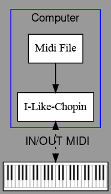
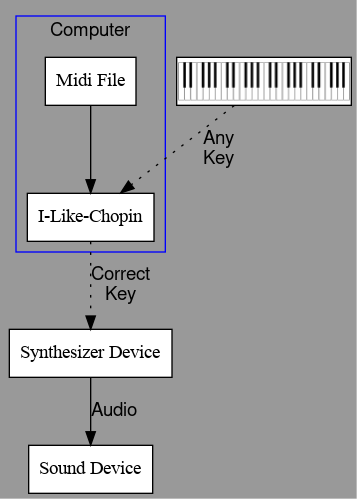

# I like Chopin
A funny program to play like Chopin.
(tribute to Gazebo)

"*In memory of all the electric pianos bought for children who no longer use them.*"

<p align="center">
    
</p>

# Description

"I like Chopin" is a very special MIDI player for Linux, Mac and Windows that uses Python3 with three operating modes: simple MIDI **player**, **passthrough**, and **playback**. The last allows you to play like Chopin. It is an awesome mode that ensures any key you press on the keyboard will always play the correct note from a selected MIDI file. You need a physical MIDI keyboard or piano connected to the computer, the selection of music is done by an internal web server, at the URL http://127.0.0.1:8888.

Bring your piano back to life and impress your friends with this musical magic trick!

# Usage
<!--
## Install poetry and libraries

```bash
curl -sSL https://install.python-poetry.org | python3 -
# You must add in your ~/.profile export PATH="/home/USERNAME/.local/bin:$PATH"
cd src
poetry install
```
-->

## Installation

<b>[Python3](https://www.python.org/)</b> and the Python package and project manager <b>[uv](https://docs.astral.sh/uv/)</b> are assumed to be already installed on your computer.

<!--
```bash
cd src/
uv run i-like-chopin.py
```
-->
### On Linux, you need utility libraries for X C Binding libxcb-cursor0 or xcb-cursor0.

```bash
apt install libxcb-cursor0
```
### On Linux, you need to use rt-audio.

```bash
usermod -a -G audio $USER
```

Edit /etc/security/limits.conf and add at the end:

```bash
# rt-audio
@audio - rtprio 90
@audio - nice -10
@audio - memlock 500000
```

## Run

```bash
cd ./src
uv run i-like-chopin.py
```

# Connections

With a Virtual Synth       |With Piano in Daw Mode     | With Rack Synth
:-------------------------:|:-------------------------:|:-------------------------:
 |  | 

# Programs and libraries used

* Python >=3.10, <3.13
* PySide6 6.7.1
* mido 1.2.10
* python-rtmidi 1.4.7
* netifaces2 0.0.22
* qrcode 7.4.2
* pillow 10.4.0
* bottle 0.13.2
* unidecode 1.3.8

# Utilities

No native virtual MIDI driver is provided with Windows, but there are a number of them available for free:

* [loopMIDI](https://www.tobias-erichsen.de/) developed by Tobias Erichsen, who also programmed a version of the Network MIDI driver for Windows.
* [MIDI Yoke](https://www.midiox.com/) which is part of the MIDI OX utility (32 bits only).

# Raspberry Pi5
> ❗ The Raspberry USB 2.0 port has issues detecting MIDI keyboard keys. This problem does not occur when using the USB 3.0 port.

# Tested with...
* Linux Debian 12 on Raspberry Pi 4 Model B and Raspberry Pi 5 8Go
* Linux Ubuntu 24.04 LTS
* Linux Mint 22 Cinnamon
* Windows 10 / [VirtualMIDISynth](http://coolsoft.altervista.org/en/virtualmidisynth) (load and play soundfonts, but very slow) + [MIDIMapper](http://coolsoft.altervista.org/en/virtualmidisynth) (Midi mapper)
* MacOS 14.6.1
* USB to Midi CME U2MIDI Pro
* Steinberg UR22mkII
* Modartt Pianoteq Stage
* Keyboard Arturia Keystep 37
* Keyboard Arturia Keylab 61 Essential
* Piano Yamaha Clavinova CLP-123 -> LOCAL OFF = press MIDI/TRANSPOSE then PIANO1 (must lite)

# Thanks

Thank you to [cyri11e](https://github.com/cyri11e) for carrying out the program tests on MacOS and for his great patience.
